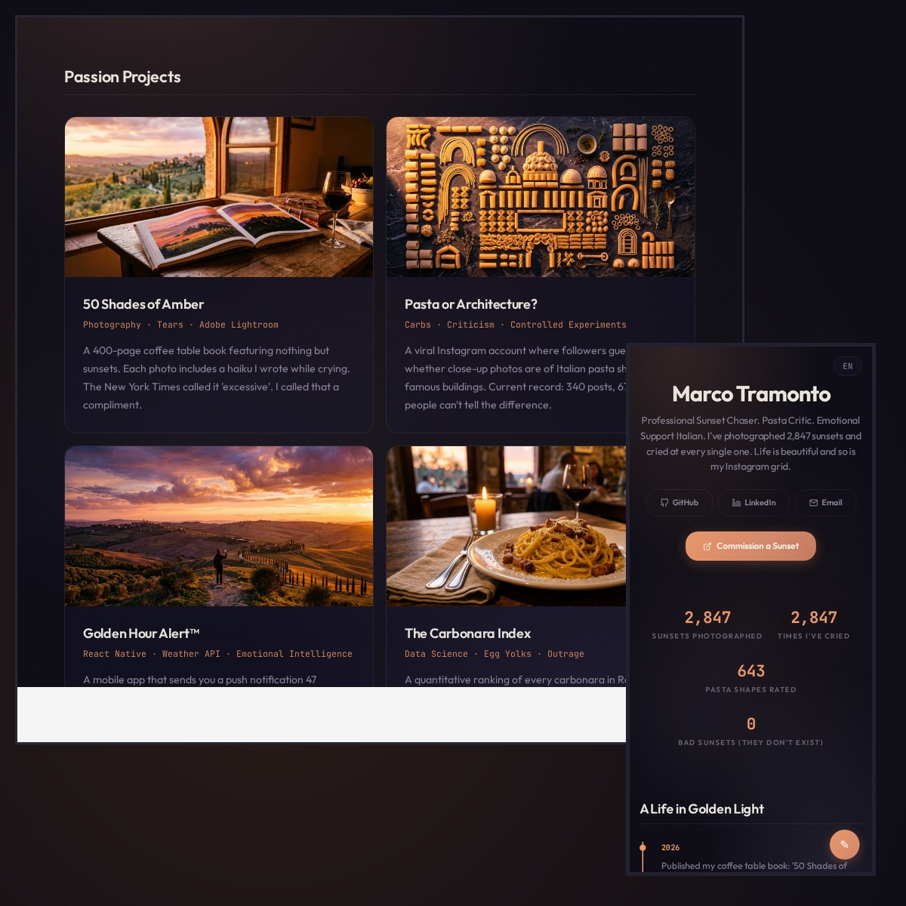
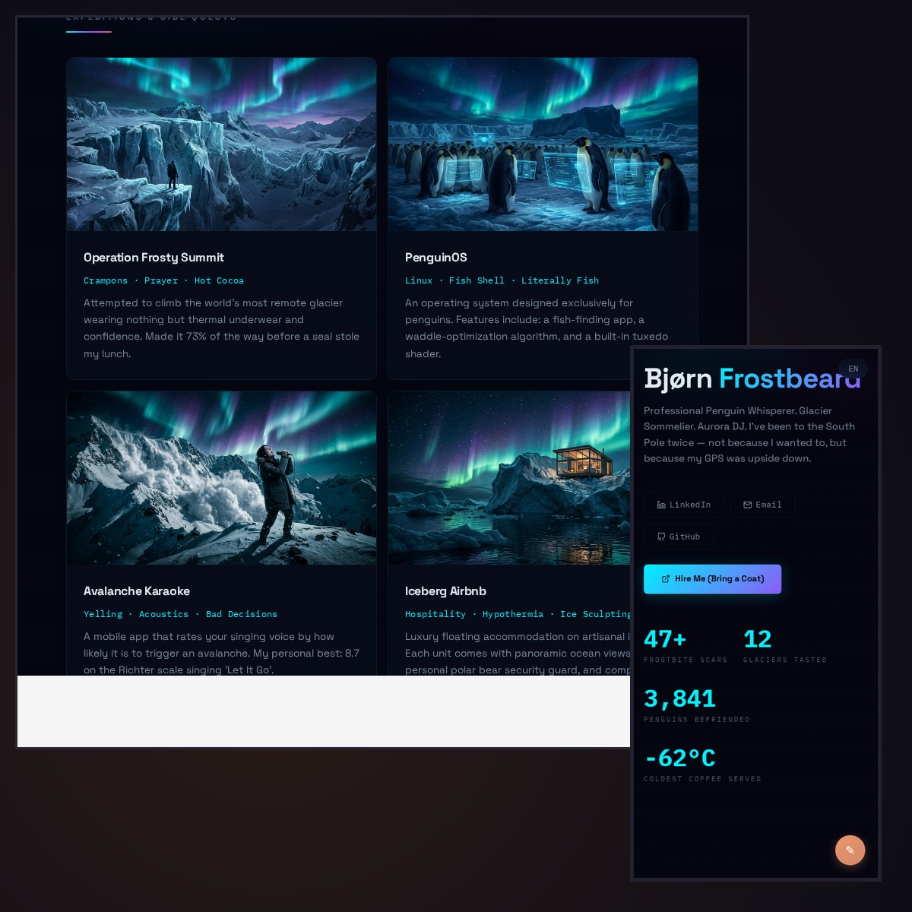
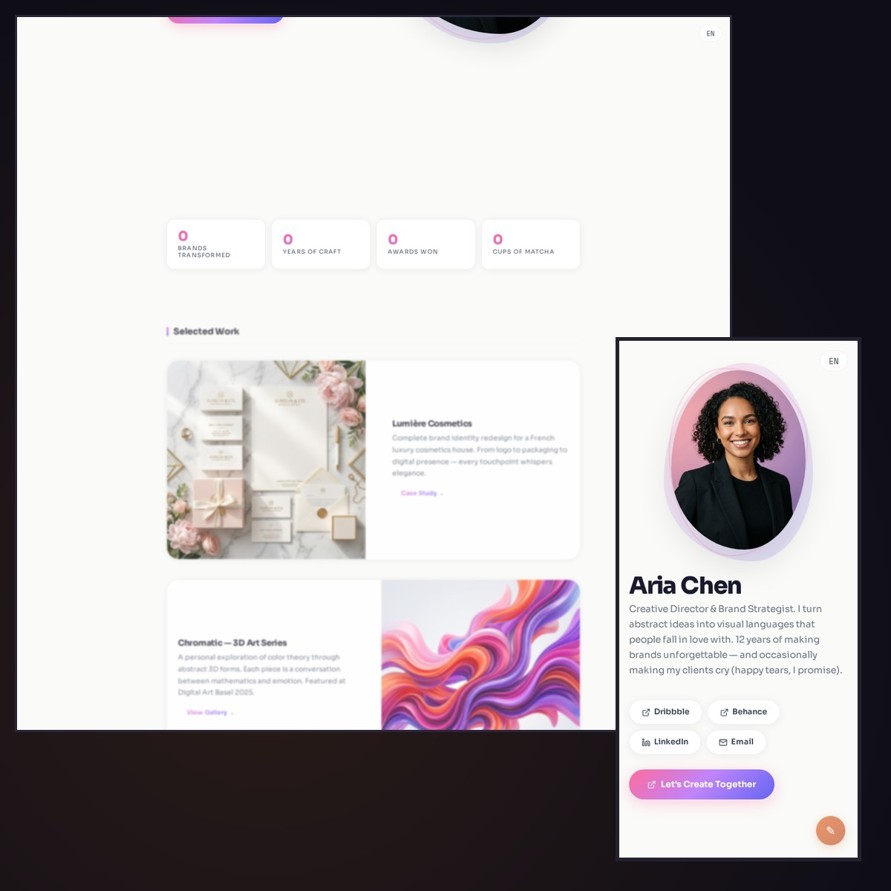
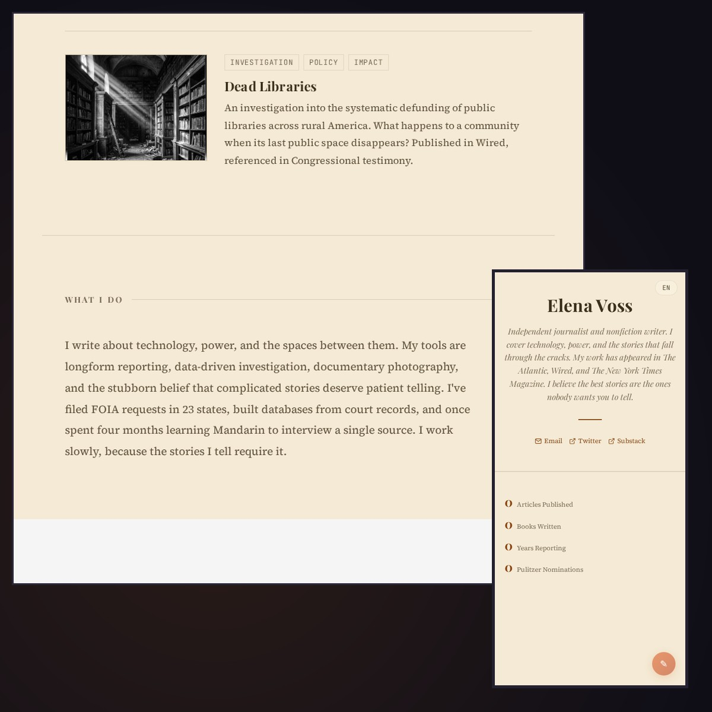
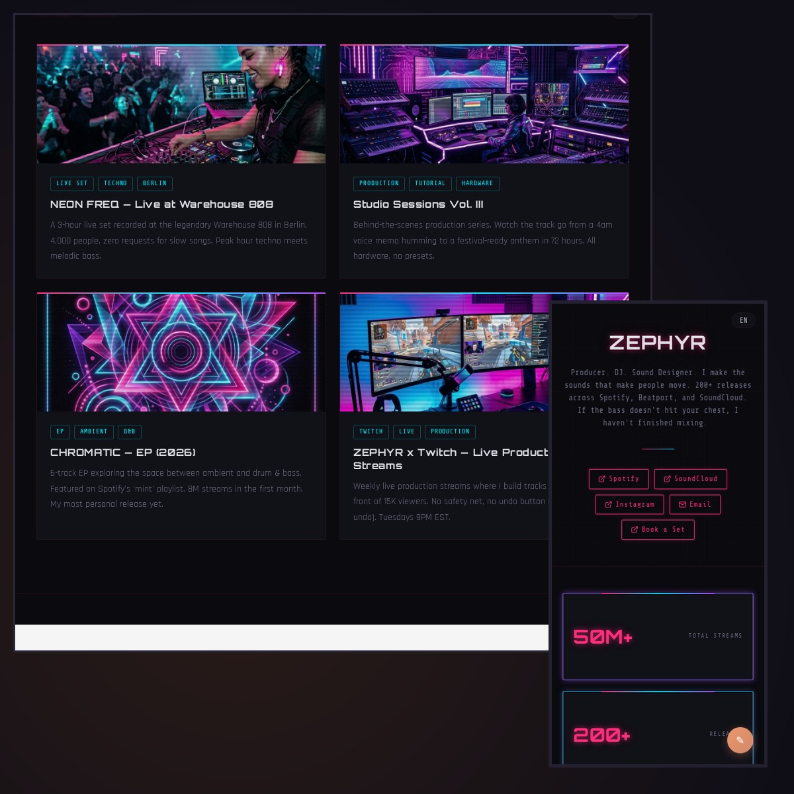

<p align="center">
  
</p>

<h1 align="center">Mold — The AI-Native Web Standard</h1>

<p align="center">
  <strong>HTML is for humans. Mold is for AI.</strong>
</p>

<p align="center">
  <a href="https://moldpage.dev"></a>
  <a href="https://github.com/GeraldYa/mold/stargazers"></a>
  <a href="LICENSE"></a>
  <a href="https://moldpage.dev/themes"></a>
  <a href="#tested-with"></a>
</p>

<p align="center">
  Paste one file into any free AI → answer a few questions → get a professional website.<br>
  No signup. No code. No credit card. <strong>Completely free.</strong>
</p>

---

## The Problem

Every time AI edits a website, it reads hundreds of lines of HTML, figures out what to change, rewrites the code, and hopes nothing breaks. That's thousands of tokens burned for one small edit.

## The Solution

Mold replaces HTML with structured JSON. AI doesn't wrestle with `<div class="card">` — it sends one API call:

```bash
# Change the hero tagline — one request, 100 tokens
curl -X PUT /api/page/portfolio/section/intro \
  -d '{"tagline": "Builder. Communicator. Maker."}'
```

**That's it.** No file reading. No parsing. No rewriting. 100 tokens instead of 3,500.

| Metric | Traditional HTML | Mold API |
|--------|-----------------|----------|
| Tokens per edit | ~3,500 | ~100 |
| AI documentation | ~1,700 tokens | ~560 tokens |
| Cost reduction | — | **97%** |

---

## 6 Themes

Every theme is free. Pick a style, grab the recipe, paste it into any AI.

<table>
<tr>
<td align="center" width="33%"><br><strong>Golden Hour</strong><br><sub>Warm · Cinematic · Creative</sub></td>
<td align="center" width="33%"><br><strong>Sterling</strong><br><sub>Navy · Gold · Finance</sub></td>
<td align="center" width="33%"><br><strong>Aurora</strong><br><sub>Cyan · Futuristic · Tech</sub></td>
</tr>
<tr>
<td align="center"><br><strong>Bloom</strong><br><sub>Gradient · Magazine · Design</sub></td>
<td align="center"><br><strong>Ink</strong><br><sub>B&W · Serif · Editorial</sub></td>
<td align="center"><br><strong>Neon</strong><br><sub>Cyberpunk · Glow · Music</sub></td>
</tr>
</table>

**[Browse all themes & moods →](https://moldpage.dev/themes)**

---

## How It Works

```
1. Pick a theme        →  moldpage.dev/themes
2. Grab the recipe     →  One-click copy
3. Paste into any AI   →  ChatGPT, Gemini, Grok, Claude — all work
4. Answer questions    →  Name, projects, skills — AI asks, you answer
5. Your site is live   →  moldpage.dev/view/your-name
```

No registration. No login. No credit card. The AI handles everything.

---

## Tested With

| AI Model | Status | Cost |
|----------|--------|------|
| ChatGPT (Free) | ✅ Pass | Free |
| Gemini Flash | ✅ Pass | Free |
| Grok Flash | ✅ Pass | Free |
| Claude | ✅ Pass | Free |
| GPT-5 (M365 Copilot) | ✅ Pass | Free |

**5/5 free AI models passed on first attempt.** The recipe is optimized to work with the cheapest models available.

---

## Features

- **6 themes** with multiple color moods each
- **Bilingual** — every page supports i18n (EN/中文 and more)
- **Visual editor** — edit your page without touching JSON
- **Theme color picker** — switch moods in the editor
- **Scroll animations** — 8 entrance animation types
- **Mobile responsive** — every theme, every device
- **14 API endpoints** — full CRUD for pages, sections, and items
- **Recipe system** — AI-optimized templates for each theme
- **Clone system** — one-click template copying, no AI needed
- **Edit tokens** — private editing with shareable view URLs

---

## API

```bash
# Create a page
POST /api/submit         { mold JSON }

# Read
GET  /api/pages          # List all pages
GET  /api/page/:id       # Get page JSON

# Update (token-protected)
PUT  /api/page/:id/section/:sid    # Update a section
PUT  /api/page/:id/meta            # Update metadata & theme

# Clone
POST /api/clone          { template, id }
```

Full docs: [API-DOCS.md](API-DOCS.md) (human) · [API-AI.md](API-AI.md) (AI-optimized, 560 tokens)

---

## Architecture

```
mold-core.js (engine)      ←  Theme-agnostic: parsing, DOM, animation, i18n, scroll reveal
     ↓
themes/*.theme.js (plugin)  ←  Self-registering: CSS, colors, layouts, section renderers
     ↓
api/server.js              ←  Express server: CRUD API, view routing, edit panel, clone system
```

Each theme is a single JS file (800-2000 lines) that registers itself with `Mold.registerTheme()` and provides renderers for all 11 section types.

To create a new theme: write `your-theme.theme.js`, register it, done. No changes to core needed.

---

## The Thesis

Three waves of digitization:

1. **Paper → Digital files** (computers can store it)
2. **Text → Vectors** (AI can understand it)
3. **Interfaces → APIs** (AI can operate it)

Mold is wave three for the web. When AI does most of the building, the format should be designed for AI — not retrofitted from human-readable code.

> *"API-ification is not just an efficiency play. It's an economic one. When every AI interaction costs tokens, a 35x reduction in cost per operation isn't a feature — it's the entire point."*

---

## Author

Built by [Gerald Yang](https://geraldya.github.io) — AI Solutions Builder, author of [Tokenomic: REPRICED by AI](https://a.co/d/04EfeYcG).

Mold was born from building 10 production web services with AI and realizing that AI editing HTML is like a Formula 1 car driving on a dirt road. The road needed to change.

---

## License

MIT — free for personal and commercial use.
